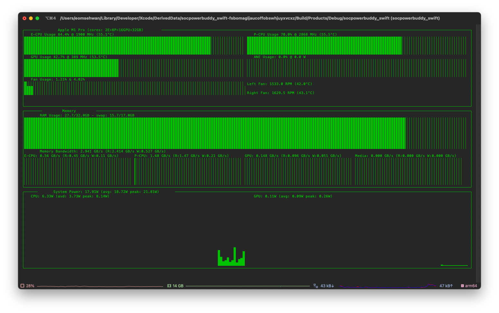

<h1 align="center">neoasitop</h1>
<p align="center">
  A sudoless performance monitoring CLI tool for Apple Silicon
</p>
<p align="center">
  
  <a href="https://github.com/op06072/NeoAsitop/releases">
    
  </a>
  <a href="https://github.com/op06072/NeoAsitop/blob/main/License">
    
  </a>
  <a href="https://github.com/op06072/NeoAsitop/stargazers">
        
    </a>
</p>



# Introducing
## What is `neoasitop`

A Swift-based `asitop`-inspired command line tool for Apple Silicon (aka M series) Macs.

`neoasitop` uses the custom [`socpowerbuddy`](https://github.com/BitesPotatoBacks/SocPowerBuddy)-inspired logic, which allows access to a variety of hardware performance counters without sudo permission. `neoasitop` is lightweight and has minimal performance impact.

**`neoasitop` officially tested on following Apple Silicon Macs!**

* Test list
  * 2021 MacBook Pro[MacBookPro18,1] (M1 Pro, Ventura)
  * 2022 Mac Studio[Mac13,2] (M1 Ultra, Ventura)
  * 2020 Mac mini[Macmini9,1] (M1, Monterey)
  * 2020 MacBook Air[MacBookAir10,1] (M1, Monterey)

## Why

Because I didn't want to be the system admin just to see the status of the system. Why kill a fly with a spear? Admin privileges are too powerful to just monitor the system.

## How it works

[`socpowerbuddy`](https://github.com/BitesPotatoBacks/SocPowerBuddy)-inspired custom logic is used to measure the following:

* CPU/GPU utilization via active residency
* CPU/GPU frequency
* CPU/GPU/ANE/DRAM energy consumption
* CPU/GPU/Media Total memory bandwidth via the DCS (DRAM Command Scheduler)
* CPU/GPU core count

[`stats`](https://github.com/exelban/stats)-inspired custom logic is used to measure the following:

* CPU/GPU/Airflow temperature
* Fan speed
* System energy consumption
* OS Version

[`sysctl`](https://developer.apple.com/library/archive/documentation/System/Conceptual/ManPages_iPhoneOS/man3/sysctl.3.html) is used to measure the following:

* CPU name
* CPU core counts
* Fan existence
* memory and swap usage

[`Hot`](https://github.com/macmade/Hot) is used to measure the following:

* SOC Throttling

Some information is guesstimated and hardcoded as there doesn't seem to be a official source for it on the system:

* CPU/GPU TDP
* CPU/GPU maximum memory bandwidth
* ANE max power
* Media engine max bandwidth

## Feature

* Utilization info:
  * CPU (E-cluster and P-cluster), GPU
  * Frequency and utilization, temperature
  * ANE utilization (measured by power)
  * Fan speed (if fan exists)
  * SOC throttling
* Memory info:
  * RAM and swap, size and usage
  * Memory bandwidth (CPU/GPU/total)
  * Media engine bandwidth usage
* Power info:
  * System power, CPU power, GPU power, DRAM power
  * Chart for CPU/GPU power
  * Peak power, rolling average display

# Installation, Usage, and Making
**Note:** Tool usage is listed by `neoasitop --help`
```shell
# advanced options
neoasitop [--interval <interval>] [--color <color>] [--avg <avg>]

OPTIONS:
  -i, --interval <interval>
                          Display interval and sampling interval for info gathering (seconds) (default: 1)
  -c, --color <color>     Choose display color (0~8) (default: 2)
  --avg <avg>             Interval for averaged values (seconds) (default: 30)
  -h, --help              Show help information.
```

## Install using Homebrew
1. If you dont have Hombrew, [install it](https://brew.sh/index_ko)!
2. Add my tap using `brew tap op06072/neoasitop`
3. Install the tool with `brew install neoasitop`
4. Run `neoasitop`!

## Install Manually
1. Download the bin from [latest release](https://github.com/op06072/NeoAsitop/releases).
2. Unzip the downloaded file into your desired dir (such as `/usr/bin`) 
4. Run `neoasitop`!

### Building the project
The source is bundled in a Xcode project. Simply build via Xcode on your mac!

### Diagnosing missing entries for your system
A diagnostic dumping tool is included within each release: `iorepdump`. It dumps all IOReport groups matching those used by NeoAsitop. It's helpful for discovering entries on new silicon.

# Credits

Special thanks to:

- [tlkh](https://github.com/tlkh) for the project [asitop](https://github.com/tlkh/asitop) that inspired me to start this project.
- [BitesPotatoBacks](https://github.com/BitesPotatoBacks) for the project [SocPowerBuddy](https://github.com/BitesPotatoBacks/SocPowerBuddy) that gave me the way to replace powermetrics.
- [exelban](https://github.com/exelban) for the project [stats](https://github.com/exelban/stats) that gave me the way to get sensor value.
- [macmade](https://github.com/macmade) for the project [Hot](https://github.com/macmade/Hot) that gave me the way to get soc throttle status.
- [rderik](https://github.com/rderik) for the project [clock](https://github.com/rderik/clock) that gave me the way to use ncurses in swift.

## Dislaimers
As I said, some information is just guesstimated. So don't blame me if it fried your new MacBook or something. ~~Well...I don't think that's going to happen.~~